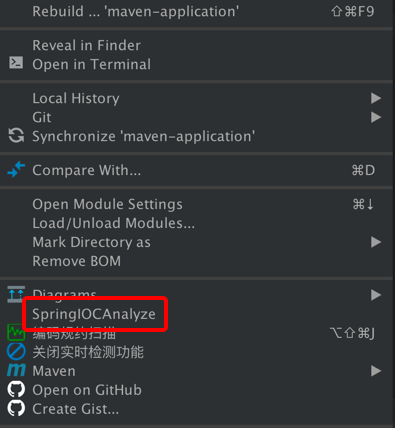
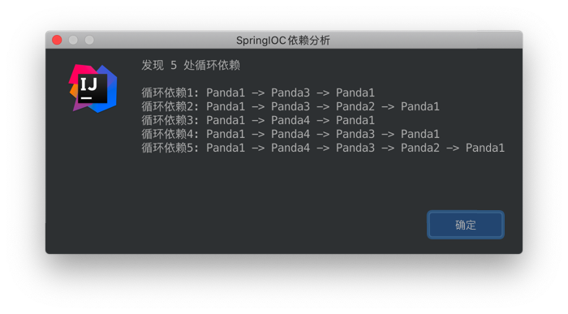

# spring-ioc-analyze-plugin
A Intellij IDEA plugin for spring IOC dependency analyze.

提供给 Spring 项目排查 Java 循环依赖问题的 Intellij 插件。

# 使用方式

1、 在 Intellij 需要分析的工程、项目或者文件目录中右击弹出菜单栏选择 【SpringIOCAnalyze】：

2、 等待分析结果，内容如下显示:

